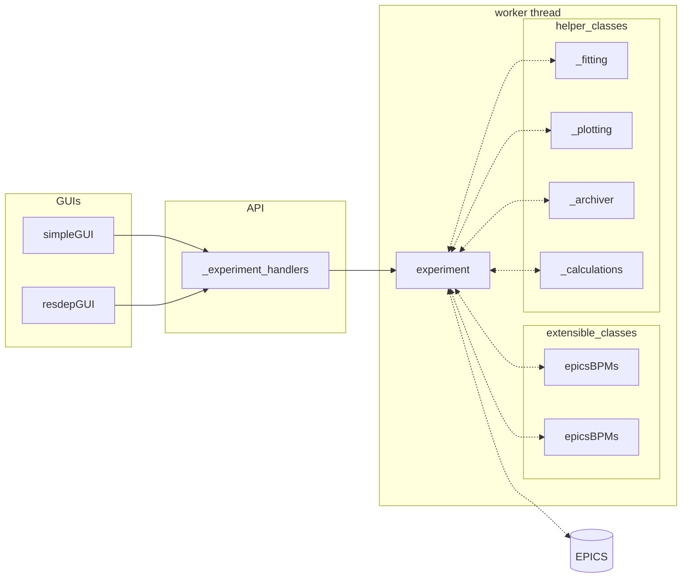
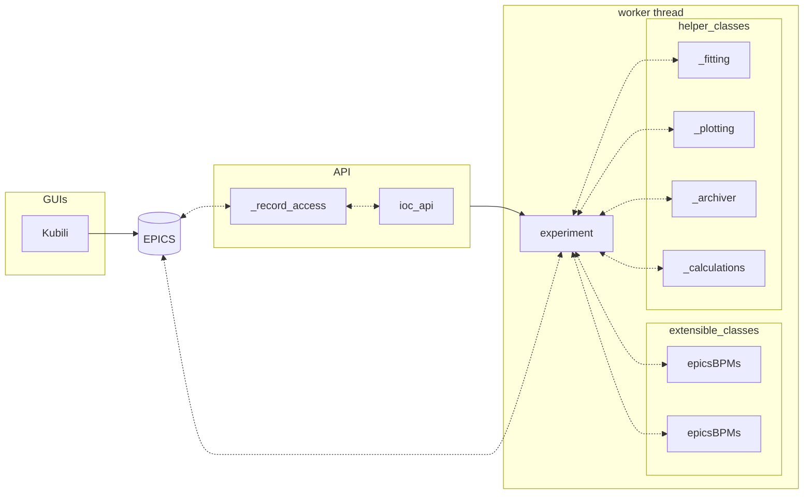

# `resdep` architecture
## Key information

- simpleGUI and resdepGUI are powered by PySide6 (python 
    wrapper for Qt)
- Kubili is plain Qt
- experiment communicates with BbB and BLMs via 
    [pyEPICS](https://pyepics.github.io/pyepics/pv.html) PVs

## Local operation (python on OPI)

## Kubili operation (through IOC)

