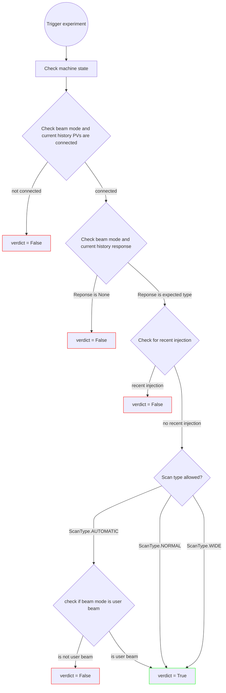

# check_able_to_run
Decision tree: check if diagnostic can run based on machine state.

```mermaid
graph TB
    A(("Trigger experiment")) --> B["Check machine state"];
    B --> C{"Check beam mode and current history PVs are connected"};
    C -->|"not connected"| D["verdict = False"]:::error;
    C -->|"connected"| E{"Check beam mode and current history response"};
    E -->|"Reponse is None"| F["verdict = False"]:::error;
    E -->|"Reponse is expected type"| G{"Check for recent injection"};
    G -->|"recent injection"| H["verdict = False"]:::error;
    G ---->|"no recent injection"| I{"Scan type allowed?"};
    I ---->|"ScanType.AUTOMATIC"| K{"check if beam mode is user beam"};
    K -->|"is not user beam"| L["verdict = False"]:::error;
    K -->|"is user beam"| J;
    I ---->|"ScanType.NORMAL"| J["verdict = True"]:::pass;
    I ---->|"ScanType.WIDE"| J;
    classDef error stroke:#f00;
    classDef pass stroke:#0f0;
```
