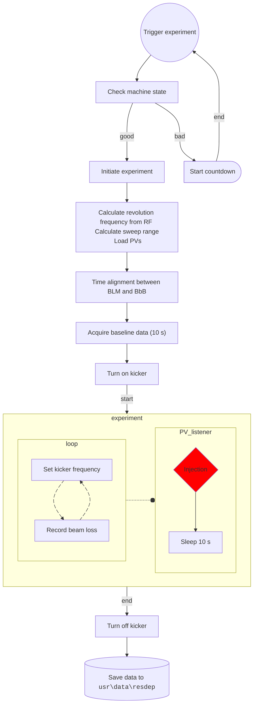

# Overview

```mermaid
graph TB
    A(("Trigger experiment")) --> B["Check machine state"];
    B --->|"good"| D["Initiate experiment"];
    C ---->|"end"| A;
    D --> E["Calculate revolution frequency from RF <br> Calculate sweep range <br> Load PVs"];
    E --> F["Time alignment between BLM and BbB"];
    F --> G["Acquire baseline data (10 s)"];
    G --> H["Turn on kicker"];
    subgraph experiment
        direction LR;
        subgraph loop;
            direction TB;
            I["Set kicker frequency"] e1@--> J["Record beam loss"];
            e1@{ animation: fast };
            J e2@--> I; 
            e2@{ animation: fast };
        end;
        subgraph PV_listener;
            direction TB;
            K{"Injection"} --> L["Sleep 10 s"];
            style K fill:#f00
        end;
    end
    H -->|"start"| experiment;
    loop -.-o PV_listener; 
    experiment -->|"end"| M["Turn off kicker"];
    M --> N[("Save data to <code>usr\data\resdep</code>")];
    B -->|"bad"| C@{ shape: delay, label: "Start countdown" };
```