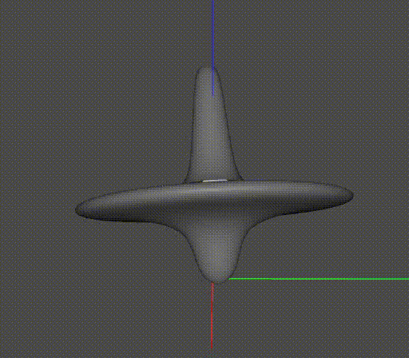

[*PixarAnimationStudios/OpenUSD*](https://github.com/PixarAnimationStudios/OpenUSD)

## Overview

An accurate measurement of the beam energy based on the polarisation of the 
beam and its dependence on the Touschek scattering cross-section 
(i.e. beam loss). 

## Features
- Operational during *user beam*
- Accurate down to single keV ($10^{-6}$ resolution)
- User friendly GUI
- Expert level GUI for machine studies

## Quick links
- Repository (
    [bitbucket](https://bitbucket.synchrotron.org.au/projects/ACC/repos/resdep/browse), 
    [github](https://github.com/liamjwatson/resdep)
)
- [Confluence](https://confluence.synchrotron.org.au/confluence/display/AP/Resonant+Depolarisation)
    (internal use only) 

## Kubili
- info on this TBC 
