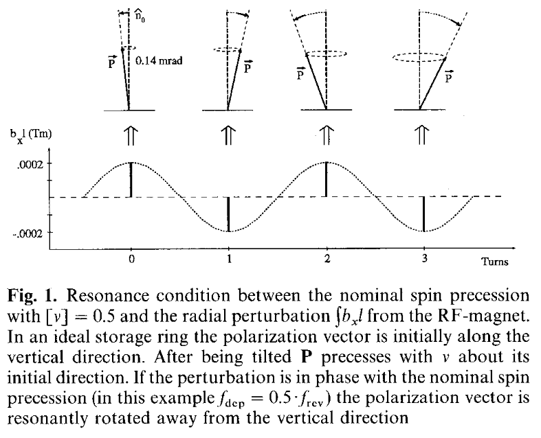
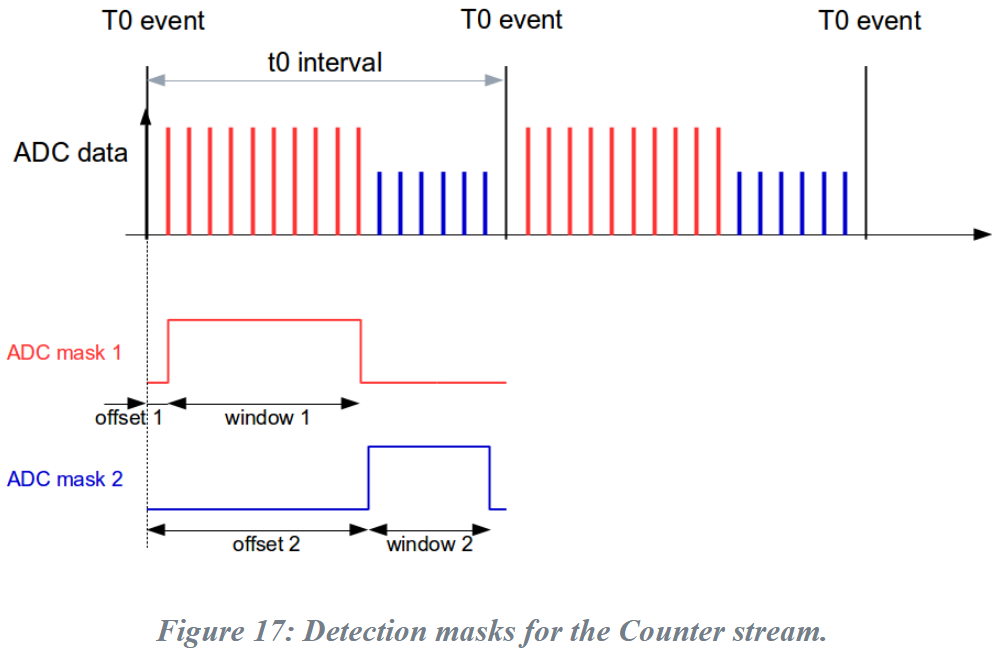
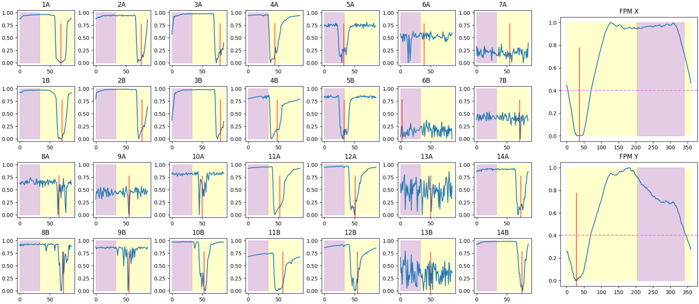

## Polarisation
The electrons in the storage ring become polarised parallel and 
anti-parallel to the dipole magnet vector (up). The Sokolov-Ternov effect 
states that with the emission of synchrotron radiation, there is a 
probability to spin flip, which is naturally skewed toward anti-parallel 
(spin flip up-to-down) such that polarisation of the beam (after enough 
time) becomes:

$$
    P_0 
    = 
    \frac{
        W_{\uparrow\downarrow}-W_{\downarrow\uparrow}
    }{
        W_{\uparrow\downarrow}+W_{\downarrow\uparrow}
    } = \frac{8}{5\sqrt{3}} = 92.38\%
$$

which is a theoretical maximum. Imperfections in the magnet fields and 
strong IDs such as wigglers can reduce the maximum achievable polarisation. 
At the Australian synchrotron, the polarisation advances to $1 - 1e^{-n}$ 
every $t_{\textrm{pol}} \approx$ 13 min (58%, 26 min = 80%, 39 min → 88%).

## Beam Loss
The dominant cause of beam loss is (typically) Touschek scattering, where 
colliding electrons exchange momentum and are subsequently lost through 
upstream bending and focussing fields (i.e. they are outside the momentum 
acceptance). The Touschek scattering cross-section is polarisation 
dependent, and therefore we expect longer beam lifetime for a polarised 
beam. Polarisation dependence arises from Pauli repulsion; a consequence of 
positive exchange and correlation energies between electrons.

## Spin Tune
The electron spin precesses about its polarised axis (up or down) at 
frequency given by the spin tune $\nu_\mathrm{spin} = [a_\mathrm{g}\gamma]$, 
where $a_\mathrm{g}$ is the anomalous gyromagnetic ratio, $\gamma = E/mc^2$ 
is the Lorentz factor, and the square brackets indicate the fractional part 
of the spin tune (i.e. for AS $\nu_\mathrm{spin} = [6.833] = 0.833$). 
**Measuring the spin tune** $[a_\mathrm{g}\gamma]$ **provides an accurate** 
**measurement of the beam energy through** $\gamma$, where the limiting 
factors of accuracy are the physical measurement of the spin tune, both the 
anomalous gyromagnetic ratio and the rest mass of the electron which are 
both known fairly accurately, resulting in keV resolution for a GeV beam.

## Depolarisation

Using a time varying magnetic field (applied to one of the kickers), we 
can kick the spin axis of the electrons off polarisation each turn, and due 
to the natural spread of energies (and therefore tunes), this results in a 
depolarised beam. In the experiment, the frequency of the magnetic field is 
swept over the expected spin tune, and at that resonant condition 
($f_\mathrm{rdp}$) the beam will depolarise, resulting in measurable beam 
losses. The step-increase in the beam losses is fitted, giving an accurate 
measurement of the spin tune and therefore beam energy *via*:

$$
    E 
    =
    \left(
        \frac{f_\mathrm{rdp}}{f_\mathrm{rev}} \mp n 
    \right)
    \frac{m_e c^2}{a_g},
    \quad \text{where} \quad
    f_\mathrm{rdp} 
    = 
    f_\mathrm{rev} \left(
        [a_g \gamma] \pm n
    \right)
$$

where $f_\mathrm{rev} =$ 1.38799 MHz is the beam revolution frequency.

L. Arnaudon et al., “Accurate determination of the LEP beam energy by resonant 
depolarization,” Z. Phys. C: Part. Fields, vol. 66, no. 1, pp. 45–62, 
Mar. 1995, doi: [10.1007/BF01496579](https://doi.org/10.1007/BF01496579).

---------------
# Complications

## Spurious polarisation changes
Changes in polarisation can be caused by a number of things in the ring, 
in particular wiggler field and undulator gap changes. These changes in 
polarisation also manifest as changes in beam loss, which can obscure 
the energy measurement. This is especially true as in order to preserve beam 
quality, only a small kick is applied, but this also reduces the strength of 
the depolarisation feature.

To greatly reduce the effect of unintended polarisation changes on the data, 
the ratio of the beam losses from two charge-equivalent halves of the beam is 
taken. One half is depolarised, while the other is untouched. This way, any 
spurious polarisation change due to ID changes - common to both parts of the 
beam - is removed during the normalisation. The resultant data includes only 
changes in beam loss due to resonant depolarisation.

## Wiggler fields
The theoretical maximum polarisation achievable ($P_0$ shown above) is 
unfortunately proportional to the magnitude of the magnetic field felt 
by the electrons around the ring. As such, strong wiggler fields both 
decrease the maximum achievable polarisation and increase the polarisation 
time by a factor of:

$$
    \frac{\oint B^3\,ds}{\oint |B|^3\,ds}
$$

Reduction in the polarisation of the beam results in a smaller change during 
resonant depolarisation, and therefore a weaker resonant peak in the data.

## Sidebands
Sidebands around the main (depolarisation) resonance frequency are created 
due to a coupling between the spin tune and the synchrotron oscillations. 
The separation between the sidebands and the main frequency equals the 
synchrotron frequency ($\omega_\mathrm{synch}$).

For AS, $\omega_\mathrm{synch} =$ 11.757 kHz (118 turns), 
corresponding to a tune of 0.00847. The sideband frequencies:w are given by:

$$
    \begin{align*}
        f_\mathrm{sb} 
        &= 
        f_\mathrm{rdp} \pm n \cdot \omega_\mathrm{synch} 
        \\
        &= 
        f_\mathrm{rdp} \pm n \cdot 11.756 \text{ kHz}
        \\
        \Rightarrow E_\mathrm{sb}
        &=
        E_0 \pm n \cdot 3.73 \text{ MeV}
    \end{align*}
$$

where $n$ is an integer.

## Crossing betatron resonances
In the extremely unlikely case that the vertical betatron tune is very far off 
its nominal frequency (or mirror tune) lands inside the scan window, this 
diagnostic has the ability to transiently drive the beam. This is not of major 
concern due to the fact that we are scanning fairly fast over the tune (5 Hz/s) 
and the fact that the betatron tune will change as the beam is driven. Still, 
it should be mentioned as a possible source of a beam dump.

--------------------
# Beam loss monitors

## ADC counter masks
As aforementioned in a 
[previous section](#spurious-polarisation-changes), 
the diagnostic takes the ratio of the beam losses between two charge 
equivalent halves of the beam, one of which is depolarised and the other is 
left untouched. This is made possible by the Libera beam loss monitor system 
which allows two separate ADC masks per revolution clock (SROC), meaning beam 
losses on different portions of the fill pattern can be collected 
independently.

[Libera beam loss monitor product page (i-tech)](https://www.i-tech.si/products/libera-blm/)

## Mask alignment with bunch-by-bunch
The two ADC masks are bounded at each end by SROC. This causes a few 
undesirable consequences. As the BLMs are evenly distributed around the ring, 
only a small number will be aligned with the bunch-by-bunch (BbB) 
depolarisation mask. As you travel around the ring, you accrue a phase shift 
between the masks. At shifts of $\pm \pi/2$, each mask contains an equal 
number of polarised and depolarised bunches and therefore no features will be 
detected. 

To align the BbB to at least one sector, we utilise the `integrated_loss` 
stream of the BLMs. The losses over many turns are integrated, and the 
resulting output reconstructs the fill pattern as a function of ADC clock 
cycles (instead of bunch number). Using the known shape of the fill pattern 
(300 filled buckets, 60 empty ones), we divide and align the masks between the 
BbB and the BLMs. Functionally, we look for the empty buckets for calibration 
and calculate the offset between the two systems. 

*Each number denotes the sector, letters: A=straight, B=bend. Purple and* 
*yellow regions indicate the two masks, as aligned to sector 1.*

---------------
# Data analysis

## Step-edge detection
