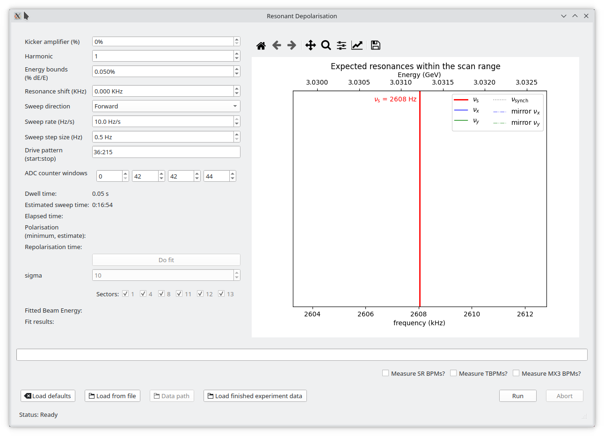
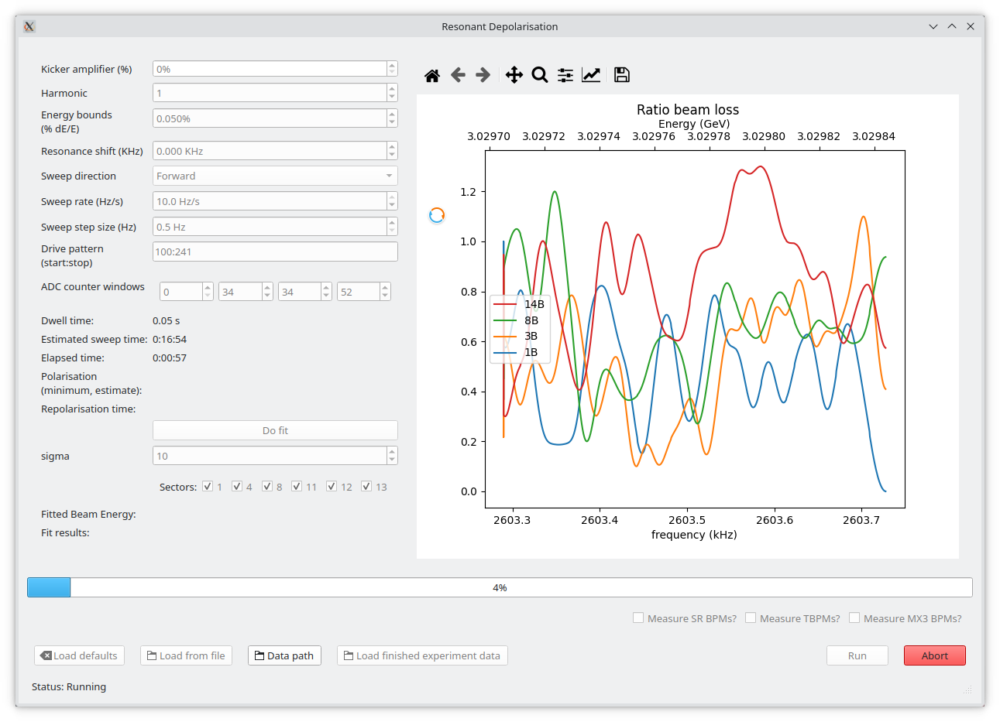

!!! warning

    This is a very loose control panel, there are very few safety measures. It is 
    easy to drive betatron resonances and dump beam. With great power comes great 
    responsibility, use it wisely.

## Main control

- "Run" button
    - Starts the resonant depolarisation experiment.
- "Abort" button
    - Aborts the current experiment (and initiates fail save procedures).

## Adjustable parameters

- Kicker amplifier (%)
    - The power applied to the bunch by bunch (BbB) kicker as a percentage of 
    its maximum output.
- Harmonic ([`int`][])
    - The harmonic of the resonance you want to drive. `0` indicates the 
    intrinsic resonance.
- Energy bounds (%, $dE/E$)
    - The range of energies you want to sweep over as a percentage of the 
    nominal beam energy.  
    *e.g.* 0.35% is the range [3.02 GeV to 3.04 GeV].
- Resonance shift (KHz)
    - Frequency shift away from the spin resonance. This is good for slight 
    adjustments or centering the data. It can also be used to move to the 
    synchrotron side bands or betatron resonances (if so desired, see warning 
    at the top of the page).
- Sweep direction ([`enum`][])
    - Direction of frequency sweep, either forward or backward. Depending on 
    the sweep rate and the kicker strength, this may change the beam energy 
    measurement as the beam may fully depolarise before the centre resonance 
    frequency is crossed, causing an imaginary shift in the energy.
- Sweep rate (Hz/s)
    - The speed over which the frequency / energy sweep is traversed. 
    !!! warning
        Values larger that 10 Hz/s may not fully depolarise the beam.
- Sweep step size (Hz)
    - Size of the frequency step in the sweep. Minimum is 0.5 Hz.

## Feedback

- Drive pattern ([`str`][] of form `start:stop`, automatically calculated)
    - The bunches being driven / depolarised. *e.g.* the first half of the 
    beam would be `"1:180"`.
- ADC counter windows (automatically calculated)
    - The ADC cycles on the BLMs that align to the driven bunches. The time 
    alignment is performed in reference to BLM01.
- Dwell time (s)
    - The dwell time the BbB kicker spends kicking at each frequency step.
- Estimated sweep time (`HH:MM:SS`)
    - Estimated time of the experiment. Always undershoots (sorry).
- Elapsed time (`HH:MM:SS`)
    - The time the experiment has been running.
- Polarisation (%, estimate)
    - The polarisation of the depolarised bunches after the end of the 
    experiment (counts up as beam repolarises).
- Repolarisation time (`HH:MM:SS`)
    - The elapsed time that the stored beam has spent repolarising.
- The plot (RHS)
    - This plot has two modes: "experiment preview" and "live data".
    - Experiment preview:
        - A very simplified plot of the frequency / energy range and the 
        location of expected resonances based on the experiment parameters.
    - live data:
        - Plots live streamed ratio beam loss at 1 Hz.
- Progress bar
    - Reports the progress of the experiment (%).
- Status (bottom LHS)
    - Status of the experiment. *e.g.* "Running" or "Injection detected".

## Fitting

- "Do fit" button
    - Performs a fit to the ratio loss data based on the plot window.  
    This means if you zoom in on the data, it will only fit to the zoomed in 
    range.
- Sigma ([`int`][])
    - The standard deviation of the gaussian convolution smoothing.
- Sector checkboxes:
    - Turn on and off the fitting of particular sectors to see the effect on 
    the derived beam energy estimate and its corresponding error. Use 
    scientific discretion.
- Fitted beam energy ([`str`][] of form "E GeV $\pm$ err keV")
- Fit results ([`str`][], (energy, error, $R^2$))

## Additional features

- Measure BPM signals (SR, TBPM, MX3)
    - Scrape the BPM signals at 10 Hz during the sweep. Was used to determine 
    impact on orbit.
- "Load defaults" button
    - Loads default experiment parameters.
- "Load from file" button (depreciated)
- "Data path" button
    - Opens the path to the current run's experiment data.
- "Load finished experiment data" button
    - Imports a finished experiment into the plotting window so plotting 
    and fitting can be re-performed.

